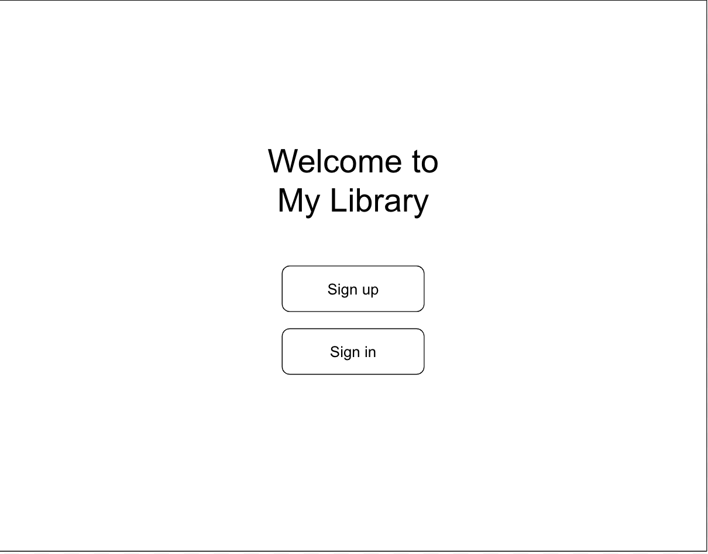
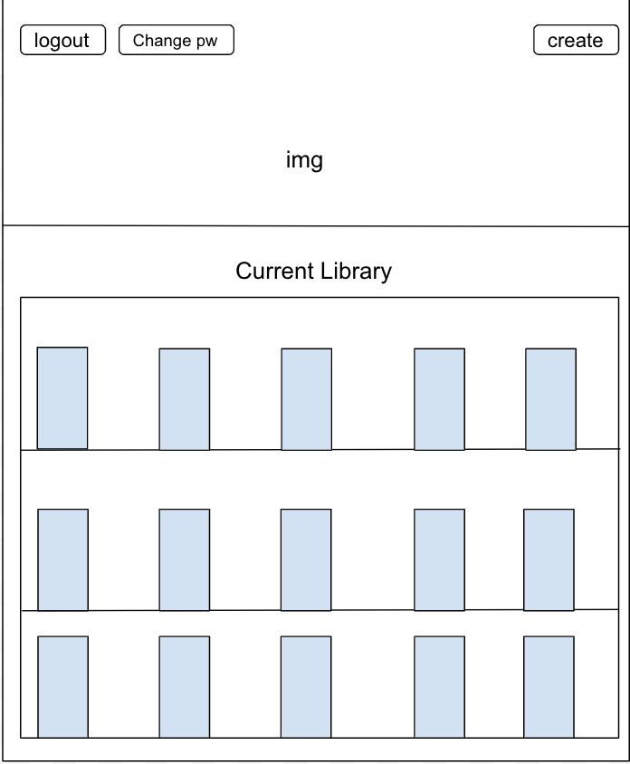
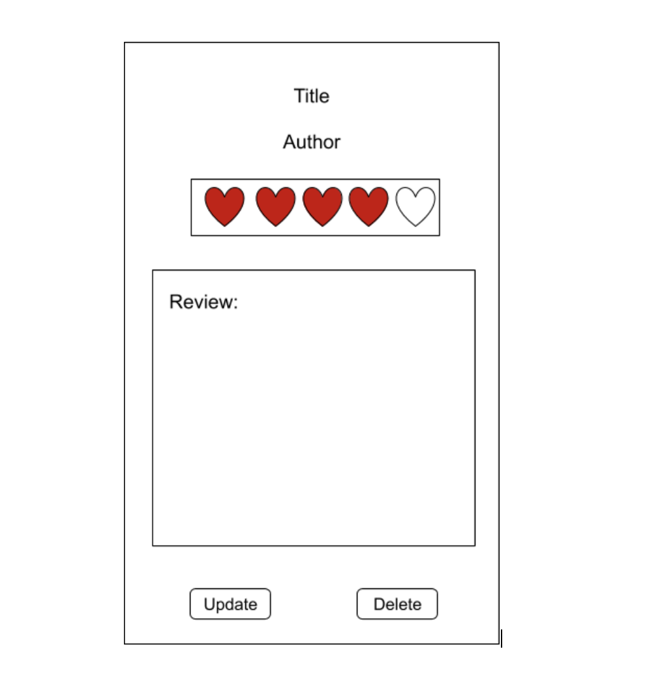

# My Library

## Important Links
Deployed Site: https://kayla-sa-w.github.io/MyLibrary-Client

Client Repo: https://github.com/Kayla-SA-W/MyLibrary-Client

API Repo: https://github.com/Kayla-SA-W/MyLibrary

Deployed Heroku: https://mylibrary-app-kw.herokuapp.com/

## Planning Story

This project is inspired by my google sheets doc of all of the books I have read over the last three years.
I wanted a place that I created to store those books as well as my thoughts and opinions of them.
I started out by creating wireframes for the different parts of the SPA that I thought were important.
After creating my wireframes I thought about the different kinds of relationships I wanted to have for my project.
I have started with a one to many relationship (one user to many books) but hope to complete a more complicated ERD.
I created a database similar to the one that I have on google docs that a collection of books.
Once my database was set up I began to work on the front end where I allowed the user to send different reuqests to the api.
Users can create, update, and delete their own books as well as see all of the books currently in their library.

## User Stories
* As a user, I want to be able to log in and look at the books I've read.
* As a user, I want to be able to give ratings to my books.
* As a user, I want to be able to add books to my library.
* As a user, I want to be able to sign in and sign out.
* As a user, I dont want other users to be able to change my ratings or reviews of a book.
* As a user, I want to be able to change my rating of a book.
* As a user, I want to be able to identify my favorite books easily.
* As a user, I want to be able to search in my books.
* As a user, I want to be able to find books by year that I've read them.

## Technologies Used
* jQuery
* HTML/CSS
* Javascript
* Bootstrap
* Handlebars
* SCSS

## Unsolved Problems and Stretch Goals
I would eventually like to add the following abilities to my project:

* Identify favorite books as well as search though books by name or author.
* Find books by the year that a user has read them
* Users recommending books to other users on the site.

## Images
Images for this project were drawn by Carlie Williams. Please checkout her portfolio at https://www.carlieann.co/

### Wireframes:

